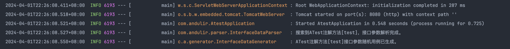

# Andulir

一款极简,协同的接口自动化测试工具,面向 `SpringBoot` 和 `Spring Cloud` ,为小型开发团队和个人开发者准备。

通过`Andulir`,你可以:
- 方便的使用注解标记你想要进行测试的接口
- 在本地启动项目后使用其自动的生成数据进行测试
- 在控制台上看到相应的测试结果。

`Andulir`将会通过一个  `atest.xml` 管理所有的测试用例,如果你对测试的结果不太满意,可以在文件中对其进行修改,再修改后再次运行项目时仍然会对之前的用例进行测试.

当对一个接口测试完成之后，你可以修改其在 `xml` 中的 `tag`，让框架忽略此用例，还可以将这个文件在 `git` 等版本管理工具中与源代码文件一同管理，以便于与你的开发伙伴，甚至是前端的对接人员很方便的共享这些接口的测试用例，大大减少开发中测试和沟通的成本。

当项目发布到生产服务器之前，将会对所有开发人员共同管理的所有用例进行统一测试，从而构成CI/CD中的重要一环。

# 1.工作流程：

## 1.1 引入：

在项目根目录内，进行拉取：

```bash
# 原仓库
git clone https://github.com/bearslyricattack/Andulir.git
# Donnie 的fork仓库
git clone https://github.com/Donnie518/Andulir.git
# Xiangyinfly的fork仓库
git clone https://github.com/Xiangyinfly/Andulir.git
```

IDEA里设为模块的方式：
1. File -> New -> Module From Existing Souces
2. 然后在Select File or Dictionary to import 窗口 **选择 `andulir.iml` 文件（很重要）**
3. 刷新 Maven 导入 Andulir 需要的依赖。（这里 Andulir 应该和其他项目是并列关系）

最后，在需要使用的模块里通过 `pom.xml`导入：

```xml
<dependency>
    <groupId>org.andulir</groupId>
    <artifactId>andulir</artifactId>
    <version>0.0.1</version>
</dependency>
```

## 1.2 配置：

Andulir主打的就是一个极简测试，所以我们尽量把所需的配置降到最低，唯一需要配置的地方是在项目的 `application.yml` ,配置项目位置及 `controller`包所在的位置，从而确定接口扫描的范围：

```yaml
andulir:
  scan-package: org.andulir.controller
```

## 1.3 使用:

### 1.3.1 增加注解:

整个工具只需要一个`@ATest`注解便可完成所有的功能,你可以使用此注解在 `Controller` 层接口方法上标记你希望测试的方法,并为其设置用例的个数:

```java
@RestController
public class TestController {
  @ATest(2)
  public void test(List<User> users,Integer integer) {
    System.out.println("test");
  }
}

```

### 1.3.2 启动项目

当对接口进行足够的标记后,便可以启动 `Andulir`。

启动方法：在main方法里直接调用 `AndulirApplication.start()` 方法。

```java
import org.andulir.AndulirApplication;

public class ExampleControllerTest {
    public static void main(String[] args) {
        AndulirApplication.start(args);
    }
}
```

### 1.3.3 atest.xml

启动后,你就可以在项目的目录下找到一个名为 `atest.xml` 的文件.(如果不存在会自动生成),并会根据带注解的方法的相关信息生成如下格式的xml文件:

```xml
<?xml version="1.0" encoding="UTF-8"?>

<aTest>
    <controllerMapping name="com.andulir.controller.TestController">
        <methodMapping name="test" status="2">
            <parameterMapping>
                <typeMapping>
                    <name>java.util.List&lt;com.andulir.controller.User&gt;</name>
                    <genericsMapping>
                        <typeMapping>
                            <name>com.andulir.controller.User</name>
                            <attributeMapping>
                                <typeMapping>
                                    <name>java.lang.String</name>
                                </typeMapping>
                                <typeMapping>
                                    <name>java.lang.String</name>
                                </typeMapping>
                                <typeMapping>
                                    <name>com.andulir.controller.User1</name>
                                    <attributeMapping>
                                        <typeMapping>
                                            <name>java.lang.Integer</name>
                                        </typeMapping>
                                        <typeMapping>
                                            <name>java.util.List&lt;java.lang.Integer&gt;</name>
                                            <genericsMapping>
                                                <typeMapping>
                                                    <name>java.lang.Integer</name>
                                                </typeMapping>
                                            </genericsMapping>
                                        </typeMapping>
                                    </attributeMapping>
                                </typeMapping>
                                <typeMapping>
                                    <name>java.util.Date</name>
                                </typeMapping>
                            </attributeMapping>
                        </typeMapping>
                    </genericsMapping>
                    <value>[{"name":"unlpVPdpxl","password":"3gfFVrxRyT","user1":{"integer":482706871,"list":[1664289742,1695992765,83605263,2058302144,1405561780]},"date":"2024-04-01T12:09:42.196+00:00"},{"name":"BkSiai4vAq","password":"sPDSTaYqEE","user1":{"integer":730295237,"list":[1972469971,1385152103,347125236,2109886458,1090042104]},"date":"2024-04-01T12:09:42.197+00:00"},{"name":"tZ3qpifkfS","password":"0oz_OzEKGv","user1":{"integer":875145769,"list":[164758244,1201554584,1389985343,1623168781,1245175018]},"date":"2024-04-01T12:09:42.198+00:00"},{"name":"geLhwE5Ekn","password":"U85tbCF9hp","user1":{"integer":334017606,"list":[1617920538,1033903769,1584460213,923489401,1974727827]},"date":"2024-04-01T12:09:42.199+00:00"},{"name":"Rq4BbyDaJn","password":"xS5NRlbABF","user1":{"integer":870916813,"list":[1156802735,1258239336,1987564550,1086998438,625813767]},"date":"2024-04-01T12:09:42.200+00:00"}]</value>
                    <value>[{"name":"xy5oKPhlZn","password":"R8syTgRQOY","user1":{"integer":1393101300,"list":[1905690013,63475114,1729317625,1509695998,156541128]},"date":"2024-04-01T12:09:42.221+00:00"},{"name":"Yo9uKrys0p","password":"9jSmvRjV0S","user1":{"integer":1333699137,"list":[699448710,5893526,1985242388,1337884773,1335871702]},"date":"2024-04-01T12:09:42.222+00:00"},{"name":"3U38xWl5q_","password":"WtTCAIUDvd","user1":{"integer":1036265010,"list":[1137478221,927619360,5731438,464153964,313636219]},"date":"2024-04-01T12:09:42.222+00:00"},{"name":"SSkttTSzpt","password":"MMDG27JCBJ","user1":{"integer":410961796,"list":[520275809,1210589417,258177185,1277217926,566056391]},"date":"2024-04-01T12:09:42.223+00:00"},{"name":"oKt5oD98SA","password":"CfsZs_oTKe","user1":{"integer":1504153069,"list":[108960699,321205562,109433437,1164202919,1811251953]},"date":"2024-04-01T12:09:42.224+00:00"}]</value>
                </typeMapping>
                <typeMapping>
                    <name>java.lang.Integer</name>
                    <value>649693351</value>
                    <value>1359726955</value>
                </typeMapping>
            </parameterMapping>
        </methodMapping>
    </controllerMapping>
</aTest>
```

- `aTest`是xml文件的主标签
- `controllerMapping`表征方法属于哪个Controller类
  - `name`为类的名称(全限定名)
- `methodMapping` 表征方法的具体信息
  - `name`是方法的名称
  - `status`是方法的状态,方法状态借鉴了git中分支合并的相关概念,当方法首次生成时,status为1(未关闭),当方法调试完成之后,手动的设置方法的status为0(已关闭).如果手动设置status大于1,就会进行status次测试
- `parameterMapping`表征方法的参数
- `typeMapping` 表征参数的类型,此标签的个数取决于参数的个数.
  - `name`为参数的类型(全限定名)
  - `value`为生成的随机测试用例
- `attributeMapping`表征方法参数的类属性
- `genericsMapping`表征`List`等类型的泛型

项目启动的时候扫描加了`ATest`注解的controller方法，并且根据注解的status属性的值生成随机测试用例

当项目第一次启动的时候,不仅仅会生成文件,还会对status为1的方法进行一次测试,并把相关的测试结果输出到控制台:


### 1.3.4 修改用例:

当你看到自己新编写或者修改的接口的第一次测试数据后,会出现两种情况:

1.随机生成的测试数据没有问题,那么可以直接修改status为0,此接口测试完成

2.如果随机生成的测试数据存在问题,那么你需要修改xml文件中对应的用例的数据,然后再次启动项目,这样Andulir会根据新的用例再次测试,并同样输出结果,如此反复,只到你认为这个接口没有问题,那么就将status修改为0,测试完成.

### 1.3.5 git同步:

将atest.xml这个文件与其他的文件一起,在git等工具中进行统一的管理.

# 2.架构设计:

Andulir主要由三部分组成:数据解析器,数据生成器,数据测试器,这三部分通过atest.xml文件为媒介,进行一系列的工作.

## 2.1 数据解析器 parser:

数据解析器主要负责解析添加了注解的接口,并生成对应的xml标签,存入文件.

将方法每个参数解析后，通过dom4j写入xml文件.

目前仅支持基本数据类型、List、自定义请求类型以及它们之间的嵌套.

## 2.2 数据生成器 generator:

数据生成器的主要作用是根据解析器解析出来的类型,自动的生成符合格式的数据.

生成数据的主要方式是通过全限定名类型的反射和podam的使用.

目前支持生成基本数据类型、单层List类型、自定义请求类型以及他们之间的嵌套.

## 2.3 数据测试器 access:

数据测试器的主要作用是通过解析xml文件,生成对应的方法然后进行测试.

一般测试接口的方式是通过http的形式进行测试,但是考虑到这个工具的主要应用场景是在本地测试,所以另辟蹊径,不使用http的方式进行测试,而是直接访问接口之下的方法.

具体实现时,因为使用反射生成的controller对象无法注入,所以使用根据名称(applicationcontext)获取bean的形式,获取到原本存在的controller-bean从而进行测试.

至于项目的自启动运行,是通过实现CommandLineRunner,并覆写run方法,从而做到在所有的bean都生成之后再开始操作.

## 2.4 其他
`AndulirConfig`文件手动注入了程序需要的一些bean

`AndulirProperty`文件支持配置文件的配置

`util`包中存放着程序需要使用的一些工具类

# 3.拓展:

## 3.1 git自定位:

原本设想git不仅仅只能管理atest.xml中的测试用例,而是能通过 git diff ,通过git commit之间的差异寻找有所修改的接口,并持续自动化测试的流程.那样会比使用注解更加方便,更加自动化.

但是当使用git获取到有所修改的文件之后,定位到这些修改需要解析所有源代码的接口并建立和维护索引,尝试之后发现难度略大,于是暂时搁置.

后续可以探索使用 java parser等相关类实现此功能的路径.

## 3.2 请求类测试（接口的参数解析优化）:

目前对请求类和List<>的适配不够完善,只有在parser和 generator中实现此功能,而测试时对其支持还不够完善.

当前的项目在需要测试的接口的参数过于复杂的时候（比如出现请求类中嵌套list，list的对象又是复杂的请求类）会出现无法正确的解析接口的参数，导致自动化测试无法进行的情况出现。（预估此项改进会相对比较复杂）

解决这个问题，可选的思路是参考open-feign的源码中关于参数解析的部分，重新设计新的实现。

## 3.3 引入方式:

目前的引入下载源代码模块 + 依赖引入，后续考虑上传 Maven 相关服务器，继续简化引入流程。

## 3.4 bug修复以及健壮性的提高：

目前的程序完全没有健壮性，如果在运行过程出现什么问题会直接报错并退出。

尝试为程序增加异常处理，容错机制等功能。

## 3.5 自动化测试：

结合jenkins或者github runner 实现在自动化部署之前进行指定或者全部接口的测试，实现更为完整的CI/CD流程。

## 3.6 mock能力：

现在的项目完全没有mock其他诸如中间件等外部依赖的能力，尝试增加以进一步简化接口测试。

# 4.写在最后:

这是笔者设计编写的第一个开源项目,来源只是平常开发中的一些简单的想法.

日常生活和代码开发中,总会有很多很多的想法出现,可能有些比较复杂有探索深度,但是更多的可能只是crud的排列组合,唯一的亮点就是本身的场景有心意,令人眼前一亮.

创意的产生和设计是简单的,或者说是可遇不可求的,而真实的代码开发则是无趣的,费力的,尤其是对软件开发的入门玩家,爱好者,以及为爱发电的小型开发团队而言.

所以产生了Andulir这款工具,或许它现在还存在这样那样的诸多bug,但是它设计的初衷就是为了更够尽自己所能的便利这些人的开发.最终目的是让个人开发者和小型开发团队也能简单的搭建出完成的Devops流程,从而有更多的机会和勇气去开发自己心中所想的软件,或自己,或与朋友一同.

在这个所有人手机中的软件,电脑上的游戏,浏览的网站大同小异的时代,我们总希望,更有创意的设计不仅仅止于设计,而能够变成完整而伟大的作品出现在我们眼前,我们总希望,能进行软件开发的绝对不仅仅只是专业的软件开发者和管理严格的软件开发团队,而是日常生活中每一个有想法的普通人或者伙伴,我们总希望,这个世界上能多一些创意,多一些设计,多一些包容,多一些震撼,点亮人心的作品.

如果你也想参与这个开源项目,请通过qq联系我:2669184984@qq.com 
